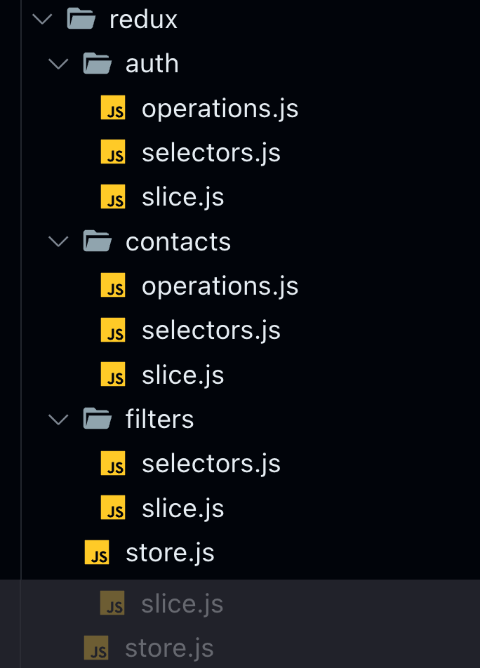
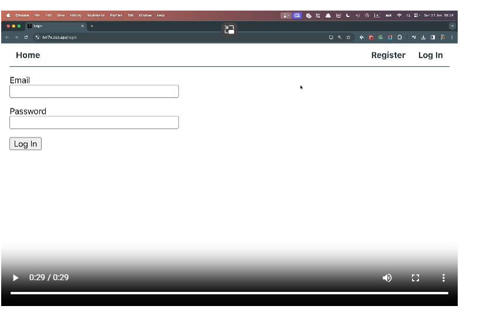
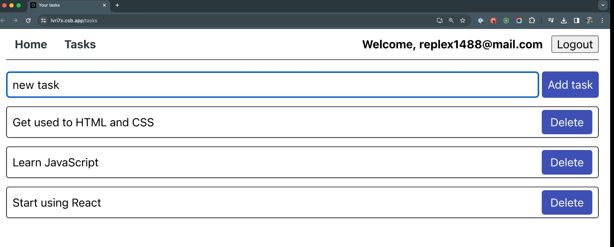

Домашнє завдання

Створіть репозиторій з назвою goit-react-hw-08
При здачі домашньої роботи надайте два посилання: одне на вихідні файли та інше на робочу сторінку завдання на Vercel.
Проект повинен бути створений за допомогою Vite.
Під час запуску коду завдання в консолі не повинно бути помилок або попереджень.
Для кожного компонента у папці src/components є окрема папка, яка містить JSX файл самого React компонента та файл його стилів. Назва папки, файла компонента (з розширенням .jsx) та файла стилів (перед .module.css) однакова і відповідає назвам, вказаним у завданнях (якщо вони були).
Для кожної сторінки у папці src/pages є окрема папка, яка містить JSX файл самого React компонента та файл його стилів. Назва папки, файла компонента (з розширенням .jsx) та файла стилів (перед .module.css) однакова і відповідає назвам, вказаним у завданнях (якщо вони були).
Для експорту компонентів використовується експорт за замовчуванням (export default).
JS-код має бути чистим і зрозумілим, використовуйте Prettier.
Використана бібліотека Redux Toolkit
Стилізація повинна бути виконана за допомогою CSS-модулів.

Книга контактів

Додайте у застосунок «Книга контактів» із домашнього завдання попереднього модуля можливість реєстрації та логіна, а також роботу з приватною колекцією контактів. Використовуйте застосунок "Планувальник завдань" з матеріалів, як приклад.

Бекенд

Для цього завдання є готовий бекенд з документацією. Використовуй його замість твого бекенда створеного через сервіс mockapi.io.

https://connections-api.herokuapp.com

Він підтримує всі необхідні операції з колекцією контактів, а також реєстрацію, логін та оновлення користувача за допомогою JWT.

Структура папок Redux

У Redux буде три слайси. Вже реалізовані вами contacts та filters, а також новий — auth, який буде відповідати за стан користувача. Під кожен слайс створіть окрему папку і файли під такі сутності як операції, селектори та логіку слайсу.

У вас має вийти наступна структура:

Перенесіть код з файлів contactsSlice.js, contactsOps.js, filtersSlice.js у нові відповідні файли.

Слайс auth

Додайте у Redux новий стан auth наступної структури:

{
user: {
name: null,
email: null,
},
token: null,
isLoggedIn: false,
isRefreshing: false,
}

Операції слайсу auth

Додайте у файл redux/auth/operations.js операції, оголошені за допомогою createAsyncThunk, для роботи з користувачем:

register - для реєстрації нового користувача. Базовий тип екшену "auth/register". Використовується у компоненті RegistrationForm на сторінці реєстрації.
login - для логіну існуючого користувача. Базовий тип екшену "auth/login". Використовується у компоненті LoginForm на сторінці логіну.
logout - для виходу з додатка. Базовий тип екшену "auth/logout". Використовується у компоненті UserMenu у шапці додатку.
refreshUser - оновлення користувача за токеном. Базовий тип екшену "auth/refresh". Використовується у компоненті App під час його монтування.

Токен авторизованого користувача потрібно зберігати в локальному сховищі за допомогою бібліотеки persist.

Маршрутизація

Додайте маршрутизацію з бібліотекою React Router. Компоненти сторінок додайте у папку src/pages. Для обгортки компонентів публічних і приватних сторінок використовуйте компоненти PrivateRoute та RestrictedRoute.

У застосунку мають бути наступні маршрути:

/ - маршрут домашньої сторінки додатка, де можна розмістити інформацію про додаток чи його розробника. Рендерить компонент Home.
/register - публічний маршрут для реєстрації нового користувача, на якому рендериться компонент сторінки Registration з формою RegistrationForm.
/login - публічний маршрут для логіна існуючого користувача, на якому рендериться компонент сторінки Login з формою LoginForm.
/contacts - приватний маршрут для роботи зі списком контактів користувача, на якому рендериться компонент сторінки Contacts.

Створіть компонент Layout, який буде рендерити компонент AppBar і огортати усі маршрути, щоб бути доступним на кожному із них.

Компонент AppBar має рендерити компонент навігації Navigation та AuthNav. Водночас авторизований користувач замість AuthNav має бачити UserMenu.

Обов’язково очищайте колекцію контактів у стані при логауті користувача.

Форми

Для форм входу (LoginForm) та реєстрації (RegistrationForm) краще використовувати бібліотеку Formik.

Додатково

Це фінальна версія застосунку, тому підходьте до завдання відповідально. Ось список ідей необов'язкових доповнень, які можуть бути в застосунку:

При введенні у текстове поле пошуку контактів фільтрація виконується не лише за ім'ям, але й за номером телефону.
При видаленні контакту необхідно підтверджувати операцію через модальне вікно.
При успішних операціях додавання та видалення контакту користувачу відображається повідомлення за допомогою React Hot Toast.
Контакти можна редагувати, бекенд підтримує PATCH-запит для оновлення контакту.
Для стилізації можна використовувати бібліотеку компонентів, наприклад Material UI.

Створіть репозиторій з назвою goit-react-hw-07
При здачі домашньої роботи надайте два посилання: одне на вихідні файли та інше на робочу сторінку завдання на Vercel.
Проект повинен бути створений за допомогою Vite.
Під час запуску коду завдання в консолі не повинно бути помилок або попереджень.
Для кожного компонента у папці src/components є окрема папка, яка містить JSX файл самого React компонента та файл його стилів. Назва папки, файла компонента (з розширенням .jsx) та файла стилів (перед .module.css) однакова і відповідає назвам, вказаним у завданнях (якщо вони були).
Для експорту компонентів використовується експорт за замовчуванням (export default).
JS-код має бути чистим і зрозумілим, використовуйте Prettier.
Використана бібліотека Redux Toolkit
Стилізація повинна бути виконана за допомогою CSS-модулів.

Книга контактів

Виконай рефакторинг коду застосунку «Книга контактів» із домашнього завдання попереднього модуля.

Видали код, що відповідає за зберігання та читання контактів з локального сховища, тобто код пов’язаний з Redux Persist.
Додай взаємодію з бекендом для зберігання контактів.

Бекенд

Створи свій персональний бекенд для розробки за допомогою UI-сервісу mockapi.io. Зареєструйся використовуючи свій обліковий запис GitHub та обери безкоштовний план.

Переглянь демо-відео, як створити бекенд-застосунок та конструктор ресурсу, щоб отримати ендпоінт /contacts.

Форма стану

Додай у стан Redux обробку індикатора завантаження та помилки HTTP-запитів. Для цього зміни форму стану слайсу контактів, додавши властивості loading та error.

{
contacts: {
items: [],
loading: false,
error: null
},
filters: {
name: ""
}
}

Операції

В папці redux створи файл contactsOps.js для зберігання асинхронних генераторів екшенів.

Використовуй функцію createAsyncThunk для оголошення операцій.
Для виконання HTTP-запитів використай бібліотеку axios.

Оголоси наступні операції:

fetchContacts - одержання масиву контактів (метод GET) запитом. Базовий тип екшену це рядок "contacts/fetchAll".
addContact - додавання нового контакту (метод POST). Базовий тип екшену це рядок "contacts/addContact".
deleteContact - видалення контакту по ID (метод DELETE). Базовий тип екшену це рядок "contacts/deleteContact".

Для коректного опрацювання помилки HTTP-запиту в середині операцій, використай конструкцію try...catch, та у блоці catch поверни результат виклику методу thunkAPI.rejectWithValue.

Обробку усіх трьох екшенів (fulfilled, rejected, pending) та зміну даних у стані Redux зроби у властивості extraReducers слайсу контактів, а от властивість reducers з нього — прибери.

Мемоізація селекторів

Після додавання властивостей loading та error у слайс контактів, виникне проблема оптимізаціі фільтрування контактів, так як вираз фільтрування буде виконуватись не тільки при зміні контактів або фільтру, а також при зміні loading та error.

Для вирішення цієї задачі:

У файлі слайсу контактів contactsSlice.js створи та експортуй мемоізований селектор selectFilteredContacts за допомогою функції createSelector.
Селектор повинен залежати від поточних масиву контактів і значення фільтра, та повертати відфільтрований масив контактів.
Селектор selectFilteredContacts імпортується у компонент списка контактів ContactList.jsx та використовується у useSelector.

Колекція контактів

Оскільки твоя колекція контактів тепер зберігається на бекенді, то:

При завантаженні додатка запит на бекенд для отримання масиву контактів зроби саме в компоненті Арр.
При створенні нового контакту додавати йому унікальний ідентифікатор більше не потрібно, це буде робити сам бекенд і повертати у відповідь об’єкт нового контакту.

Створи репозиторій з назвою goit-react-hw-06
При здачі домашньої роботи надай два посилання: одне на вихідні файли та інше на робочу сторінку завдання на Vercel.
Проект повинен бути створений за допомогою Vite.
Під час запуску коду завдання в консолі не повинно бути помилок або попереджень.
Для кожного компонента у папці src/components є окрема папка, яка містить JSX файл самого React компонента та файл його стилів. Назва папки, файла компонента (з розширенням .jsx) та файла стилів (перед .module.css) однакова і відповідає назвам, вказаним у завданнях (якщо вони були).
Для експорту компонентів використовується експорт за замовчуванням (export default).
JS-код має бути чистим і зрозумілим, використовуйте Prettier.
Використана бібліотека Redux Toolkit
Стилізація повинна бути виконана за допомогою CSS-модулів.

Книга контактів

Виконай рефакторинг коду твого застосунку «Книга контактів» із домашнього завдання третього модуля. Додай управління станом за допомогою бібліотеки Redux Toolkit, замість локального React стану.

Папки та файли

Створи папку src/redux для зберігання файлів, пов'язаних із логікою Redux:

store.js - файл створення стору
contactsSlice.js - файл слайсу для контактів
filtersSlice.js - файл слайсу для фільтрів

Початковий стан

Нехай початковий стан Redux виглядає наступним чином.

{
contacts: {
items: []
},
filters: {
name: ""
}
}

Тут ми виділимо два слайси - контакти (поле contacts) і фільтри (поле filters).

Слайс контактів

У файлі contactsSlice.js оголоси слайс контактів, використовуючи функцію createSlice().

Екшени слайса для використання в dispatch:

addContact - додавання нового контакту до властивості items
deleteContact - видалення контакту за id з властивості items

Оголоси функції-селектори для використання в useSelector:

selectContacts - повертає список контактів з властивості items.

З файла слайса експортуй редюсер, а також його екшени і селектори.

Слайс фільтра

У файлі filtersSlice.js оголоси слайс фільтра, використовуючи функцію createSlice().

Екшени слайса для використання в dispatch:

changeFilter - зміна значення фільтра в властивості name

Оголоси функції-селектори для використання в useSelector:

selectNameFilter - повертає значення фільтра з властивості name.

З файла слайса експортуй редюсер, а також його екшени і селектори.

Бібліотека React Redux

Зв'яжи React-компоненти з Redux-логікою за допомогою хуків useSelector та useDispatch бібліотеки React Redux.

Усі компоненти, крім карточки контакту Contact у списку контактів ContactList, не повинні приймати жодних пропсів. Замість цього, компоненти мають використовувати хук useSelector та функції-селектори слайсів для отримання необхідних їм значень.

Для відправки екшенів компоненти використовують хук useDispatch та оголошені раніше екшени слайсів:

Форма ContactsForm відправляє екшен додавання контакту при сабміті
Карточка контакту Contact відправляє екшен видалення контакту при кліку по кнопці видалення
Поле фільтра SearchBox відправляє екшен зміни фільтра при введенні в текстове поле

Бібліотека Redux Persist

Використай бібліотеку Redux Persist для збереження масиву контактів у локальному сховищі.

У файлі store.js:

Створи конфігурацію для збереження поля items зі слайса контактів.
Використовуй persistReducer, щоб застосувати конфігурацію до редюсера слайса контактів.
Використовуй persistStore для створення persistor для PersistGate.

Створіть репозиторій з назвою goit-react-hw-03.
При здачі домашньої роботи надайте два посилання: одне на вихідні файли та інше на робочу сторінку завдання на Vercel.
Проект повинен бути створений за допомогою Vite.
Для створення форм використовуйте бібліотеку Formik.
Під час запуску коду завдання в консолі не повинно бути помилок або попереджень.
Для кожного компонента у папці src/components є окрема папка, яка містить JSX файл самого React компонента та файл його стилів. Назва папки, файла компонента (з розширенням .jsx) та файла стилів (перед .module.css) однакова і відповідає назвам, вказаним у завданнях (якщо вони були)
Для експорту компонентів використовується експорт за замовчуванням (export default).
JS-код має бути чистим і зрозумілим, використовуйте Prettier.
Стилізація повинна бути виконана за допомогою CSS-модулів.

Книга контактів

Напиши застосунок для зберігання контактів телефонної книги. Застосунок повинен складатися з форми, списку контактів та поля пошуку для фільтрації списку контактів. Подивіться демо-відео роботи застосунку.

Компоненти

У цьому завданні інтерфейс вже розділений на компоненти. Твоя задача - обдумати стан і пропси та перенести це в код. Частини інтерфейсу, які входять в компонент, відзначені рамкою відповідного кольору.

Треба виділити наступні компоненти: кореневий компонент, форма додавання контактів, список контактів, елемент списку контактів та фільтр пошуку.

Як бачиш, всі компоненти рендеряться всередині компонента App. Його розмітка виглядатиме так, плюс пропси та інший код.

  <h1>Phonebook</h1>
  <ContactForm />
  <SearchBox />
  <ContactList />

На цей раз ми будемо давати тобі менше підказок, ніж у минулому домашньому завданні. Це зроблено спеціально, щоб ти поступово звик до розробки компонентів, їх пропсів і логіки додатка.

Крок 1 - Список контактів

У стані компонента App повинен бути масив контактів. На етапі розробки буде зручно жорстко закодувати деякі дані в стані. Це уникне необхідності ручного введення даних у інтерфейсі для тестування нового функціоналу. Наприклад, використай цей масив контактів для початкового значення стану.
[
{id: 'id-1', name: 'Rosie Simpson', number: '459-12-56'},
{id: 'id-2', name: 'Hermione Kline', number: '443-89-12'},
{id: 'id-3', name: 'Eden Clements', number: '645-17-79'},
{id: 'id-4', name: 'Annie Copeland', number: '227-91-26'},
]

Створіть компоненти ContactList та Contact та використовуйте їх для відображення списку контактів. Передайте необхідні значення через пропси.

Після цього кроку інтерфейс застосунку буде виглядати наступним чином - заголовок сторінки та список контактів.

Крок 2 - Пошук за ім'ям

Додайте поле пошуку SearchBar, яке можна використовувати для фільтрації списку контактів за ім'ям.

Поле пошуку – це інпут без форми, значення якого записується у стан (контрольований елемент).
Логіка фільтрації повинна бути нечутливою до регістру.

Стан фільтру слід зберігати в компоненті App і передавати потрібні значення як пропси компоненту SearchBox. Тоді фільтрація масиву контактів буде виконуватися в компоненті App, а її результат - масив відфільтрованих контактів - передавати пропсом компоненту ContactList.

Після цього кроку при вводі тексту в поле пошуку, список контактів повинен оновлюватися, щоб відобразити лише підходящі контакти.

Крок 3 - Додавання контактів

На цьому етапі реалізуй додавання контакту до списку контактів через форму ContactForm. Кожен контакт повинен бути об'єктом з властивостями name, number та id, тобто таким самим, як в тестових даних, які зараз знаходяться у тебе в стані.

Для генерації ідентифікаторів використовуй будь-який відповідний пакет, наприклад nanoid. У майбутньому цим буде займатися база даних, а поки що додаємо ідентифікатор об'єкта самостійно, наприклад, під час сабміту форми.

Форму обов'язково створи за допомогою бібліотеки Formik. Додай валідацію полів форми бібліотекою Yup та виведи повідомлення про помилки:

поля повинні бути обов'язковими для заповнення
мінімальна кількість символів - 3
максимальна кількість символів - 50
Після завершення цього кроку застосунок повинен виглядати приблизно так.

Крок 4 - Видалення контактів

Розшир функціонал застосунку, дозволяючи користувачу видаляти раніше збережені контакти кліком по кнопці Delete в карточці контакта.

Крок 5 - Збереження контактів

Застосунок повинен зберігати масив контактів між оновленням сторінки в локальному сховищі. Використовуй ефекти.

Під час додавання та видалення контакту контакти зберігаються у локальне сховище.
Під час завантаження застосунку контакти, якщо такі є, зчитуються з локального сховища і записуються у стан.

